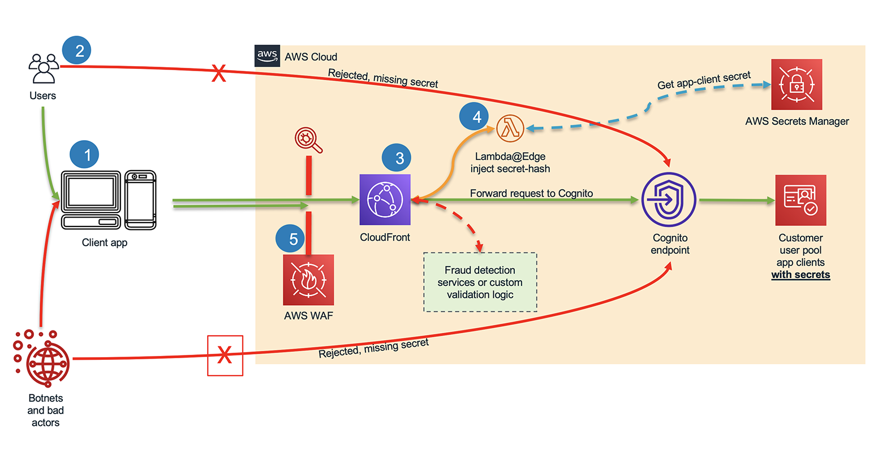

# Cognito proxy

A proxy that can be used transparently to front any cognito client. It can be deployed as lambda@edge.

This proxy is based on AWS Security Blog post [Protect public clients for Amazon Cognito by using an Amazon CloudFront proxy](https://aws.amazon.com/blogs/security/protect-public-clients-for-amazon-cognito-by-using-an-amazon-cloudfront-proxy/.).

With this proxy you can go beyond Cognito's Advanced Security and implement security controls on the proxy itself or through [Web Application Firewall](https://aws.amazon.com/waf/). 



# Usage

## The function

```ts
import { createHandler } from 'cognito-proxy';

export const handler = createHandler({
    secretLookup: async (clientId) => {
        const clientSecret = await secretLookupCustomImplementation(clientId)
        return clientSecret;
    }
})
```

### Strategies

The `secretLookup` function implements a strategy to lookup your secrets. For your convenience, this package has with the following strategies:

- fetchFromCognito
- fetchFromSSM
- constant

#### fetchFromCognito

In the following case the strategy will perform the [DescribeUserPoolClient](https://docs.aws.amazon.com/cognito-user-identity-pools/latest/APIReference/API_DescribeUserPoolClient.html) action in Cognito to lookup the secret.

The `fetchFromCognito` strategy needs to receive an object mapping all supported clientIds to its pool ids.

One advantage of this strategy is that you don't have to update secrets manually. The disadvantage is the need for an additional request to cognito on every request.

For this strategy to work you need to setup the right IAM permissions to your function to read cognito data.

```ts
import { createHandler, fetchFromCognito } from 'cognito-proxy';


export const handler = createHandler({
    secretLookup: fetchFromCognito({"my-client-id": "my-pool-id"})
})
```

#### fetchFromSSM

One common strategy is to store and look secrets up in SSM.

For this strategy to work you need to setup the right IAM permissions to your function to read the relevant SSM params.

```ts
import { createHandler, fetchFromCognito } from 'cognito-proxy';


export const handler = createHandler({
    secretLookup: fetchFromSSM()
})
```

The default behavior is to fetch a secret with the second part of the function name (as done in the AWS article). You can simply override that, for instance, to have a secret key based on the client id:

```ts
import { createHandler, fetchFromCognito } from 'cognito-proxy';


export const handler = createHandler({
    secretLookup: fetchFromSSM({
        secretIdLookup: (clientId) => `my-secret.${clientId}`
    })
})
```

#### constant

```ts
import { createHandler, constant } from 'cognito-proxy';


export const handler = createHandler({
    secretLookup: constant({'my-client-id': 'my-client-secret'})
})
```

It can also be a string.

```ts
import { createHandler, constant } from 'cognito-proxy';


export const handler = createHandler({
    secretLookup: constant('my-client-secret')
})
```


## Road map

[] Provide ready-made CloudFormation and CDK recipes for deployment.

## Choco open source

<div style="background: rgba(0, 0, 50, 0.1)">

- [Contributing](./docs/CONTRIBUTING.md)
- [Code of Conduct](./CODE_OF_CONDUCT.md)
- [License](./LICENSE.md)
- [Security](./docs/SECURITY.md)
- [Changelog](./CHANGELOG.md)

</div>
